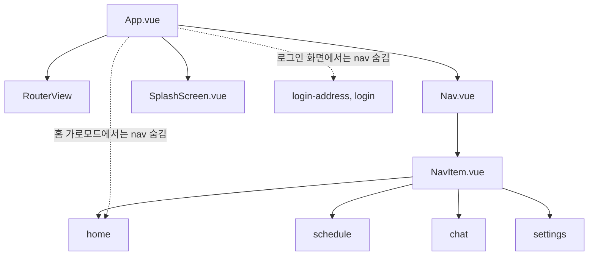
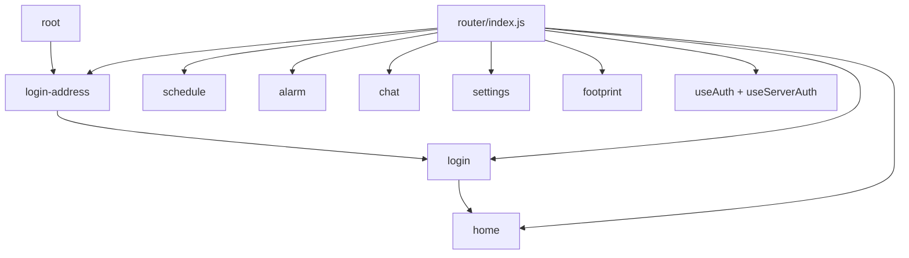
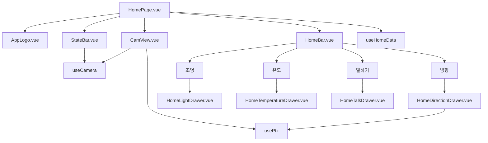
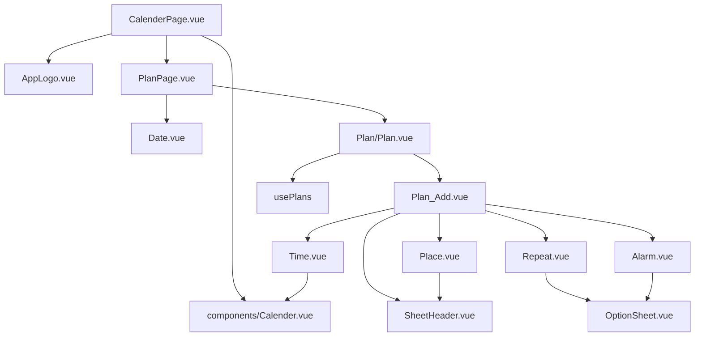
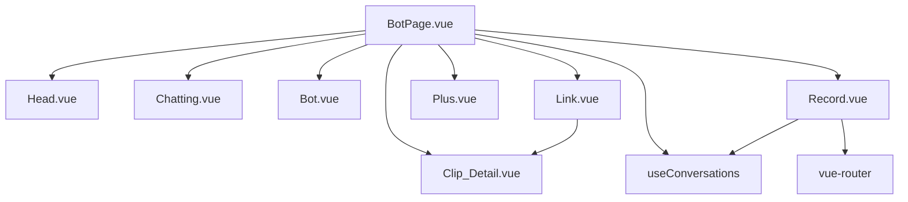
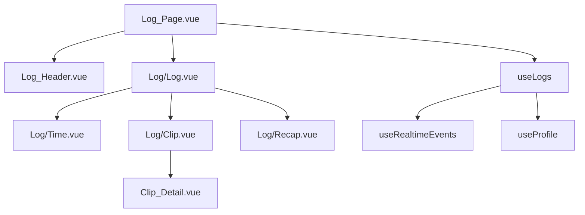
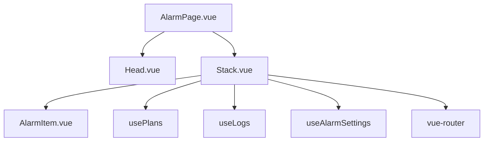
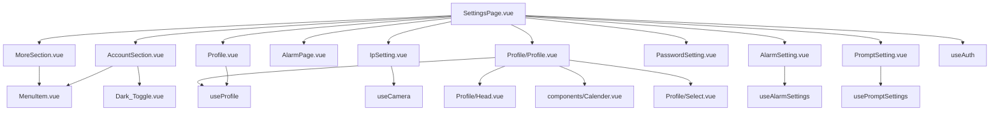
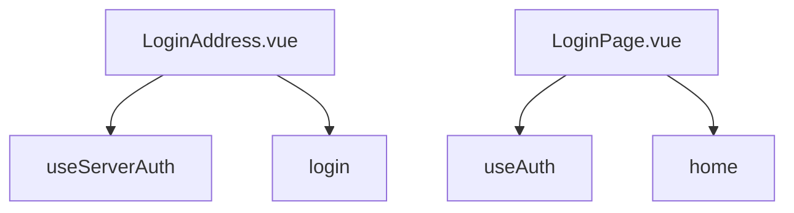
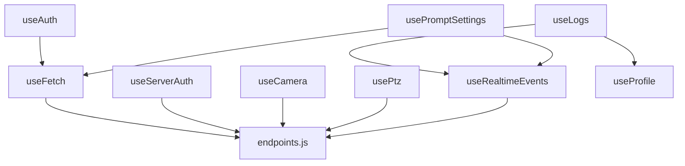

# wally205 페이지 구조도

> 개발 기록은 [docs/DEVELOPMENT_LOG.md](./docs/DEVELOPMENT_LOG.md)에 정리합니다.

## 앱 전체 구조

주요 관계:
- `App.vue`는 앱의 공통 레이아웃을 담당한다. 현재 라우트 화면은 `RouterView`에 렌더링되고, 하단 네비게이션과 스플래시는 앱 전역에서 함께 관리된다.
- 로그인 관련 화면과 홈 가로 카메라 모드는 전체 화면으로 사용하기 때문에 `Nav`를 숨기고, 그 외 주요 화면에서는 하단 네비게이션을 보여준다.
- 전역 테마 클래스는 `App.vue`에서 관리하며, 페이지들은 공통 CSS 변수와 레이아웃 규칙을 공유한다.
- 실제 화면 기능은 `views` 아래 페이지 컴포넌트가 맡고, 반복되는 UI는 `components`, 상태/서버 통신 로직은 `composables`, API 경로는 `endpoints.js`에 모아둔다.

## 라우터 구조

주요 관계:
- 모든 경로는 `src/router/index.js`에서 선언하고, 실제 path 값은 `src/constants/index.js`의 `ROUTES` 상수를 사용한다.
- `/`로 들어오면 먼저 `/login-address`로 이동한다. 서버 주소 설정 후 `/login`, 로그인 완료 후 `/home`으로 이어지는 흐름이다.
- `beforeEach` 가드는 `useAuth`와 `useServerAuth` 상태를 확인해서 인증되지 않은 사용자를 로그인 주소 화면으로 돌려보낸다.
- 이미 로그인된 사용자가 `/login-address` 또는 `/login`에 접근하면 홈으로 이동시켜 중복 로그인 흐름을 막는다.
- 하단 네비게이션은 홈, 캘린더, 챗봇, 설정 네 개의 주요 탭을 직접 연결하고, 알림과 로그 기록은 페이지 내부 액션이나 별도 라우트로 진입한다.

## 홈 페이지

주요 관계:
- 홈은 사용자가 가장 먼저 보는 실시간 제어 화면이다. 카메라 화면을 중심으로 상태 확인, 조명, 온도, 말하기, 방향 제어를 한 곳에서 처리한다.
- `HomeBar`가 어떤 홈 컨트롤 드로어를 열지 결정한다.
- `HomeTemperatureDrawer`는 warm/cool 모드, 희망 온도, 현재 온도, 아크 위치, `Tem` 아이콘을 담당한다.
- `CamView`는 카메라/HLS/PTZ UI를 담당하고, PTZ 열림 상태를 `HomePage`로 전달한다.

## 캘린더 / 일정

주요 관계:
- 캘린더는 날짜를 고르고 해당 날짜의 케어 일정을 확인하거나 등록하는 페이지다.
- `/schedule`은 `CalenderPage`를 렌더링하고, 내부에서 일정 영역으로 `PlanPage`를 사용한다.
- 일정 추가/수정은 바텀시트 흐름이며 시간, 장소, 반복, 알림 시트로 나뉜다.
- 일정 데이터는 `usePlans`가 관리하고, 날짜 선택은 캘린더 컴포넌트에서 상위로 전달된다.

## 챗봇 페이지

주요 관계:
- 챗봇은 사용자 질문과 시스템 응답을 대화 형태로 보여주는 페이지다. 필요하면 영상 링크나 녹음 흐름도 함께 연결된다.
- 메시지 타입에 따라 봇 말풍선, 링크 말풍선, 사용자 말풍선 컴포넌트가 다르게 렌더링된다.
- 영상 링크는 공용 `Clip_Detail` 시트를 연다.
- 녹음 시트는 선택한 대화 id를 가지고 챗봇 페이지로 돌아올 수 있다.

## 로그 기록 페이지

주요 관계:
- 발자국 아이콘으로 진입하는 화면은 반려동물의 로그를 시간순으로 기록하고 확인하는 페이지다.
- `/footprint` 라우트는 로그 기록과 미디어 클립을 보여준다.
- 클립 항목은 공용 `Clip_Detail` 시트를 연다.
- 로그 데이터는 실시간 이벤트와 프로필 데이터를 함께 사용한다.
- 날짜 query가 있으면 특정 날짜 기록으로 진입할 수 있다.

## 알림 페이지

주요 관계:
- 알림 페이지는 사용자가 확인해야 할 일정 알림과 이상 감지 알림을 모아 보여준다.
- 알림 목록은 일정 알림과 이상/로그 알림을 함께 다룬다.
- 이상 알림을 선택하면 `/footprint`로 이동할 수 있다.
- 같은 `AlarmPage`가 설정 페이지의 모달로도 재사용된다.

## 설정 페이지

주요 관계:
- 설정 페이지는 계정, 프로필, 테마, 알림, 카메라 연결, 프롬프트 같은 앱 환경을 관리하는 중심 화면이다.
- 설정 페이지는 여러 모달/시트를 `show*` 상태로 열고 닫는다.
- 계정 섹션은 프로필, 비밀번호, 알림 설정 흐름을 연다.
- 더보기 섹션은 카메라 IP 설정과 프롬프트 설정 흐름을 연다.
- 로그아웃은 `useAuth`를 통해 처리하고 로그인 주소 화면으로 이동한다.

## 로그인 흐름

주요 관계:
- 로그인 흐름은 서버 주소 설정과 사용자 인증을 분리해서 처리한다.
- `LoginAddress`에서 서버 주소를 먼저 저장/검증한다.
- `LoginPage`에서 사용자 로그인을 처리한 뒤 홈으로 이동한다.
- 라우터 가드는 인증 상태에 따라 로그인 화면 또는 홈 화면으로 이동시킨다.

## 공용 데이터 / 서비스 흐름

주요 관계:
- `endpoints.js`는 저장된 Wally 호스트와 환경 변수를 기준으로 API 서버, 앱 런타임 서버, 스트리밍 서버 주소를 만든다.
- `useFetch`는 공통 fetch 래퍼로 JSON 파싱, 에러 처리, 인증 토큰 첨부, 401 발생 시 토큰 갱신 흐름을 담당한다.
- 인증, 카메라, PTZ, 실시간 이벤트 composable은 직접 API 주소를 만들지 않고 `endpoints.js`의 경로 헬퍼를 통해 서버에 접근한다.
- `useLogs`는 실시간 이벤트와 프로필 정보를 조합해서 로그 화면에서 사용할 기록 데이터로 정리한다.
- `usePromptSettings`는 실시간 이벤트로 현재 설정을 받고, 저장/수정 요청은 `useFetch`를 통해 보낸다.

## 네비게이션 요약

| 페이지 | 라우트 | 메인 컴포넌트 | nav 표시 |
| --- | --- | --- | --- |
| 서버 주소 로그인 | `/login-address` | `LoginAddress.vue` | 표시 안 함 |
| 로그인 | `/login` | `LoginPage.vue` | 표시 안 함 |
| 홈 | `/home` | `HomePage.vue` | 표시함, 단 홈 가로 카메라 모드는 숨김 |
| 캘린더 | `/schedule` | `CalenderPage.vue` | 표시함 |
| 챗봇 | `/chat` | `BotPage.vue` | 표시함 |
| 설정 | `/settings` | `SettingsPage.vue` | 표시함 |
| 로그 기록 | `/footprint` | `Log_Page.vue` | 표시함 |
| 알림 | `/alarm` | `AlarmPage.vue` | 라우트로도 있고 설정 모달로도 재사용 |
