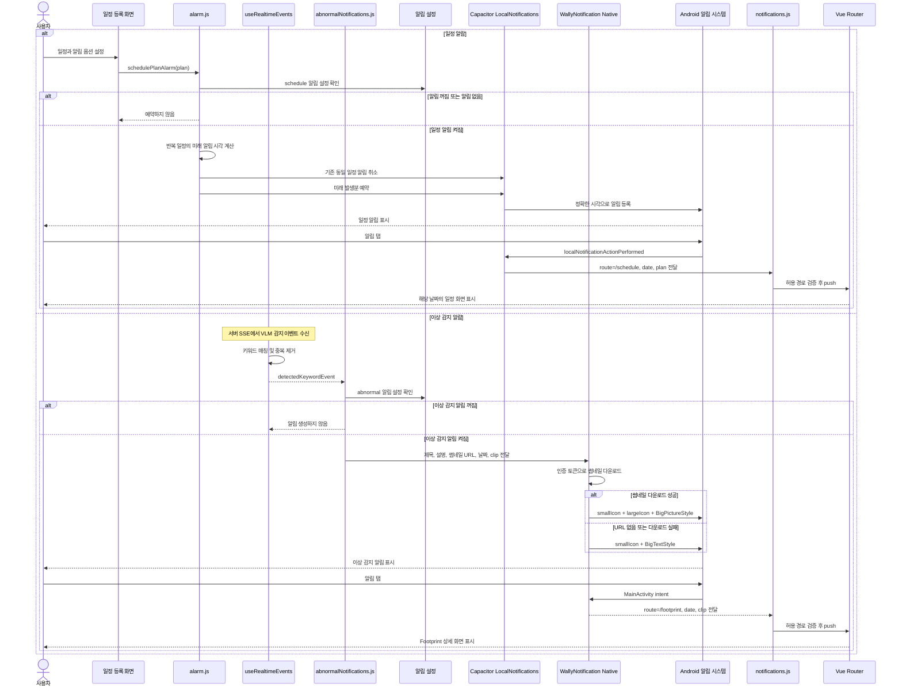

# Wally Android Notification Sequence UML

## 컨테이너 및 역할

| 컨테이너 | 역할 |
|---|---|
| User | 일정 알림 옵션을 설정하고, 휴대폰에 표시된 일정·이상 감지 알림을 탭해 해당 화면으로 이동합니다. |
| Wally Server | 카메라 스트림과 카메라/VLM 분석에서 발생한 이상 감지 이벤트를 SSE로 프론트엔드에 전달합니다. 일정 데이터는 관리하지 않습니다. |
| Wally Frontend | Vue 화면과 composable 계층입니다. 일정 데이터를 `localStorage`에서 관리하고 일정 알림을 계산·예약하며, SSE 이상 이벤트를 수신해 알림 설정을 확인하고, 알림 탭 후 Vue Router로 화면 전환을 처리합니다. |
| Notification Layer | `Capacitor LocalNotifications`와 `WallyNotification Native`로 구성됩니다. 일정 알림 예약, 이상 감지 알림 생성, Android 알림 채널·권한 처리, 알림 클릭 데이터 전달을 담당합니다. |
| Android Phone | Android OS의 `AlarmManager`/`NotificationManager`가 예약된 알림 또는 즉시 알림을 시스템 영역에 표시합니다. 앱이 백그라운드여도 예약된 일정 알림을 표시하며, 사용자의 탭을 앱에 전달합니다. |

### Wally Frontend 내부 컨테이너

| 컨테이너 | 역할 |
|---|---|
| UI & Routing | 일정 등록 화면에서 알림 옵션을 받고, 알림 탭으로 전달된 경로를 검증한 뒤 일정 또는 Footprint 화면으로 이동시킵니다. |
| Shared State Management | `usePlans`, `useRealtimeEvents`, `useAlarmSettings`를 통해 일정, 실시간 이상 이벤트, 사용자 알림 설정을 공유 상태로 관리합니다. |
| Schedule Alarm | `alarm.js`, `scheduleAlarmSync.js`가 반복 일정을 계산하고 미래 일정 알림을 예약·취소·동기화합니다. |
| Abnormal Notification | `abnormalNotifications.js`가 SSE 이상 감지 이벤트의 중복을 제거하고, 알림 설정에 따라 즉시 알림 생성을 요청합니다. |
| Notification Core | `notifications.js`가 알림 권한·채널을 준비하고, 로컬/네이티브 알림 클릭 데이터를 받아 안전한 화면 경로로 연결합니다. |

