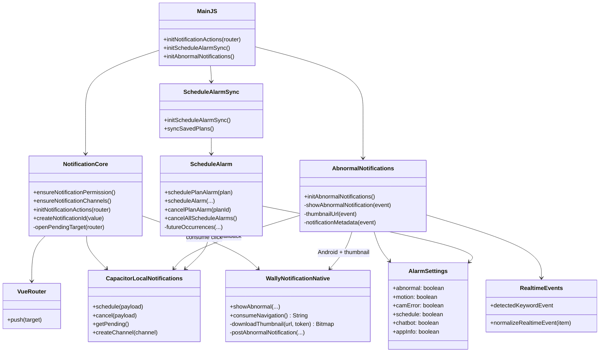
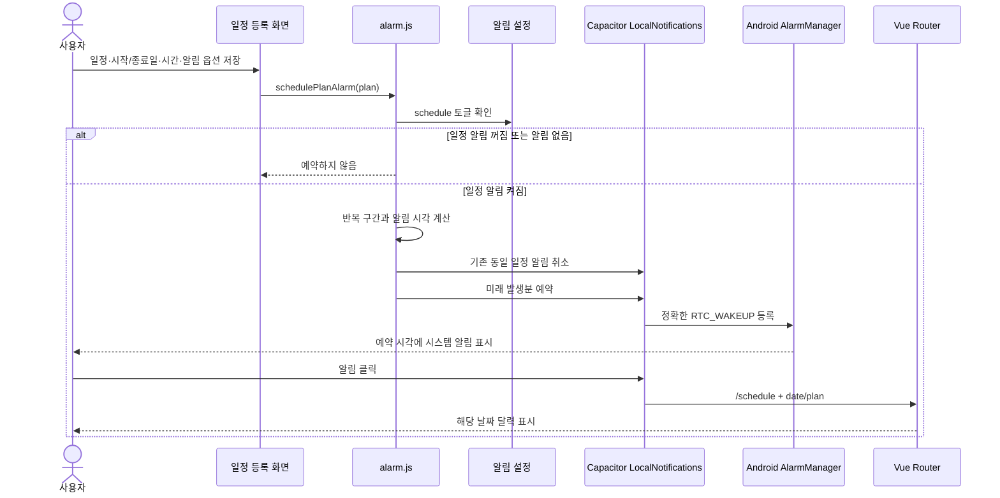
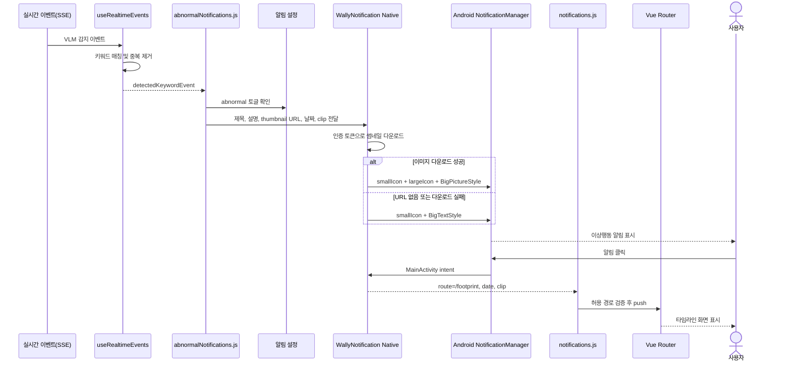
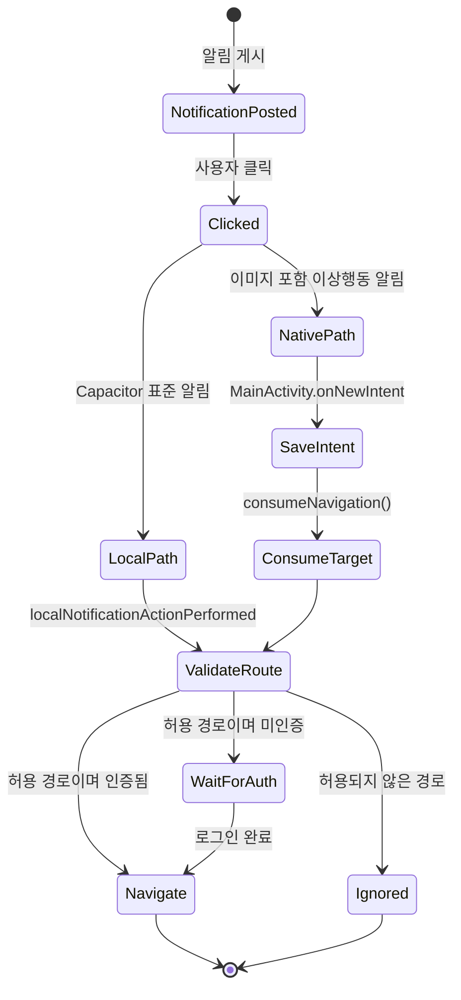

# Wally Android 알림 시스템 정리

## 1. 문서 목적

이 문서는 Wally 앱에 적용한 Android 휴대폰 알림 기능의 구조와 동작을 정리한다. 일정 알림, 이상행동 알림, 알림 클릭 이동, Android 권한, 이미지 썸네일 및 현재 구현 범위를 포함한다.

앱 내부 화면의 기존 UI/UX는 변경하지 않았으며, 휴대폰 시스템 알림과 알림 클릭 후 기존 화면을 여는 동작만 추가했다.

## 2. 구현 결과 요약

| 항목 | 현재 상태 | 주요 동작 |
|---|---|---|
| 일정 알림 | 실제 이벤트 연결 완료 | 일정에서 선택한 알림 옵션에 맞춰 예약하고 클릭 시 달력으로 이동 |
| 이상행동 알림 | 실제 실시간 이벤트 연결 완료 | 감지 키워드와 설명, 타임라인 썸네일을 표시하고 클릭 시 타임라인으로 이동 |
| 움직임 감지 | 표시 형식 테스트 완료, 실제 이벤트 미연결 | 이벤트 발생 지점과 알림 호출 연결 필요 |
| 카메라 연결 오류 | 표시·이동 규칙 구현, 실제 이벤트 미연결 | 클릭 시 설정의 카메라 프로필 패널을 바로 표시 |
| 챗봇 | 표시·이동 규칙 구현, 실제 이벤트 미연결 | 클릭 시 챗봇 화면으로 이동하고 대화 ID가 있으면 해당 기록 표시 |
| 앱 정보 수신 | 표시 형식 테스트 완료, 실제 이벤트 미연결 | 앱 소식 수신 API 또는 푸시 이벤트 연결 필요 |
| 앱 내부 알림 목록 | 기존 구현 유지 | 이번 작업에서 UI나 저장 구조를 변경하지 않음 |

## 3. Android 알림 표시 규칙

Android 시스템 알림의 배치는 제조사, Android 버전, One UI 버전에 따라 달라진다.

- `smallIcon`은 Android 필수 아이콘이며 시스템이 흰색 단색 마스크로 표시한다.
- Wally 전용 단색 아이콘 `ic_stat_wally`를 사용한다.
- 컬러 앱 아이콘을 표준 알림의 특정 위치로 강제 배치할 수는 없다.
- 일정 알림에는 큰 아이콘을 사용하지 않는다.
- 이상행동 알림은 접힌 상태에서 오른쪽에 작은 타임라인 썸네일을 표시한다.
- 이상행동 알림을 펼치면 상세 설명과 큰 타임라인 이미지를 표시한다.
- 펼친 상태에서는 오른쪽 작은 썸네일을 숨긴다.
- 썸네일 URL이 없거나 다운로드에 실패하면 텍스트 알림으로 정상 대체한다.

## 4. 알림별 문구와 이동 화면

| 알림 유형 | 접힌 제목 예시 | 펼친 내용 | 클릭 결과 |
|---|---|---|---|
| 일정 | `예방접종 일정이 있습니다` | 일정 날짜와 시간 | `/schedule?date=YYYY-MM-DD&plan=ID` |
| 이상행동 | `'낙상' 이상행동이 감지되었습니다` | 타임라인 설명과 썸네일 | `/footprint?date=YYYY-MM-DD&clip=ID` |
| 움직임 감지 | `움직임이 감지되었습니다` | 감지 설명 | 아직 지정하지 않음 |
| 카메라 오류 | `카메라 연결에 문제가 발생했습니다` | 연결 상태 확인 안내 | `/settings?panel=camera` |
| 챗봇 | `Wally 챗봇 답변이 도착했습니다` | 답변 확인 안내 | `/chat` 또는 `/chat?id=대화ID` |
| 앱 정보 | `새로운 앱 소식이 있습니다` | 새 기능·소식 안내 | 아직 지정하지 않음 |

알림 이동은 허용 목록 방식으로 제한한다. 현재 허용된 경로는 일정, 타임라인, 챗봇, 설정 화면이다. 알림 데이터가 임의의 다른 경로를 전달해도 이동하지 않는다.

## 5. 전체 컴포넌트 UML



## 6. 일정 알림 시퀀스 UML



## 7. 이상행동 알림 시퀀스 UML



## 8. 알림 클릭 처리 흐름



## 9. 일정 예약 규칙

### 알림 옵션

일정 추가 화면에서 선택한 옵션을 그대로 사용한다.

- 없음
- 5분 전
- 10분 전
- 15분 전
- 30분 전
- 1시간 전
- 2시간 전
- 1일 전
- 2일 전
- 1주 전

계산된 알림 시각이 이미 지났다면 해당 발생분은 예약하지 않는다.

### 반복 일정

- 시작일과 종료일 사이의 실제 반복 발생분만 계산한다.
- 매일, 매주, 매월, 매년 반복을 지원한다.
- 과거 알림은 제외하고 미래 알림만 예약한다.
- 임의의 32회 제한은 사용하지 않는다.
- 일정 수정·삭제 또는 알림 옵션을 `없음`으로 변경하면 해당 일정 ID의 기존 예약을 취소한다.

## 10. Android 권한과 채널

### 권한

- Android 13 이상: `POST_NOTIFICATIONS` 사용자 권한 필요
- 정확한 일정 예약: `SCHEDULE_EXACT_ALARM` 선언 및 시스템 허용 필요
- 이미지 다운로드: `INTERNET` 권한 사용

### 채널

| 채널 ID | 화면 이름 | 용도 |
|---|---|---|
| `wally_schedule` | 일정 알림 | 일정 및 현재 테스트용 일반 앱 알림 |
| `wally_abnormal` | 이상행동 알림 | 이상행동, 움직임, 카메라 관련 알림 |

채널의 소리와 진동은 앱이 별도로 강제하지 않고 사용자의 휴대폰 채널 설정을 따른다.

## 11. 알림 설정 토글

설정 화면에는 다음 키가 저장된다.

| 키 | 표시 항목 | 실제 이벤트 연결 상태 |
|---|---|---|
| `abnormal` | 이상행동 | 연결 완료 |
| `motion` | 움직임 감지 | 미연결 |
| `camError` | 카메라 연결 오류 | 미연결 |
| `schedule` | 일정 | 연결 완료 |
| `chatbot` | 챗봇 | 미연결 |
| `appInfo` | 앱 정보 수신 | 미연결 |

토글 값은 `localStorage`의 `wally:alarmSettings`에 저장된다. 일정 토글을 끄면 예약된 일정 알림을 취소하며, 다시 켜면 저장된 미래 일정을 재예약한다.

## 12. 주요 소스 파일

| 파일 | 역할 |
|---|---|
| `src/utils/notifications.js` | 권한, 채널, 클릭 이동, 허용 경로 검증 |
| `src/utils/alarm.js` | 일정 알림 시각·반복 계산, 예약·취소 |
| `src/utils/scheduleAlarmSync.js` | 일정 토글 및 저장 일정 재동기화 |
| `src/utils/abnormalNotifications.js` | 이상행동 이벤트를 Android 알림으로 변환 |
| `src/composables/useRealtimeEvents.js` | 실시간 이벤트 정규화, 키워드 감지, 썸네일 URL 생성 |
| `src/composables/useAlarmSettings.js` | 알림 설정 토글 저장 |
| `src/views/SettingsPage/SettingsPage.vue` | `panel=camera` 수신 시 카메라 프로필 패널 열기 |
| `android/app/src/main/java/com/wally/app/MainActivity.java` | 이미지 다운로드, BigPictureStyle, 네이티브 클릭 인텐트 |
| `android/app/src/main/res/drawable/ic_stat_wally.xml` | Android 단색 작은 알림 아이콘 |
| `android/app/src/main/AndroidManifest.xml` | 인터넷 및 정확한 알람 권한 선언 |

## 13. 실제 기기 검증 결과

Samsung SM-A826S, Android 14(API 34)에서 다음을 확인했다.

- 알림 권한 허용 상태
- 정확한 알람 권한 허용 상태
- 일정 알림의 정확한 시각 예약 및 게시
- Wally 단색 작은 아이콘 표시
- 일정 알림 클릭 후 달력 이동
- 이상행동 알림의 접힌 썸네일 표시
- 펼친 상태에서 상세 설명과 큰 이미지 표시
- 펼친 상태의 작은 썸네일 제거
- 이상행동 알림 클릭 후 타임라인 이동
- 챗봇 알림 클릭 후 챗봇 화면 이동
- 카메라 오류 알림 클릭 후 카메라 프로필 패널 표시
- 6개 설정 항목의 샘플 알림 동시 게시

## 14. 알려진 제한 및 후속 작업

1. 이상행동 알림은 현재 앱의 SSE 연결이 살아 있을 때 발생한다. 앱이 완전히 종료된 상태에서도 서버 이벤트 알림을 받으려면 FCM과 백엔드 디바이스 토큰 전송 기능이 필요하다.
2. 움직임 감지, 카메라 오류, 챗봇, 앱 정보 알림은 실제 이벤트 발생 지점과 아직 연결되지 않았다.
3. 제조사와 Android 버전에 따라 알림 카드의 여백, 아이콘 위치, 확장 버튼 모양은 달라질 수 있다.
4. 타임라인 이벤트에 썸네일 URL이 없거나 인증·네트워크 문제로 다운로드하지 못하면 이미지 없이 텍스트만 표시한다.
5. 챗봇의 특정 기록으로 이동하려면 알림 데이터에 실제 대화 ID를 `query.id`로 넣어야 한다.

## 15. 후속 이벤트 연결 시 권장 데이터 형식

```js
{
  id: 123456,
  title: '알림 제목',
  body: '',
  largeBody: '확장 설명',
  smallIcon: 'ic_stat_wally',
  channelId: 'wally_schedule',
  autoCancel: true,
  extra: {
    route: '/chat',
    query: { id: 'conversation-id' },
  },
}
```

실제 이벤트 연결 시에는 각 설정 토글을 확인하고, 안정적인 정수 알림 ID를 사용하며, 클릭 경로는 반드시 허용 목록에 추가해야 한다.
